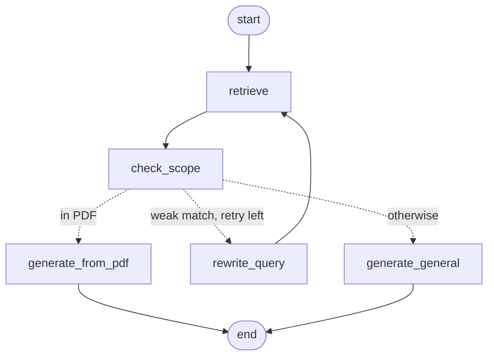

# PDF RAG — hybrid retrieval in the terminal

Ask questions about your PDFs from the command line. Answers come from the PDF with page citations.
When a question isn't covered by the PDF, the app still answers from the LLM's general knowledge,
but flags it clearly: **⚠ NOT FROM THE PDF**. The analytics panel shows the evidence behind every verdict.

## How it works

The question-answering flow is a [LangGraph](https://langchain-ai.github.io/langgraph/) state machine
(`src/graph/`). Print it any time with `python main.py graph`.



Inside `retrieve`:

```
question ─┬─ dense search (FastEmbed + ChromaDB) ─┐
          └─ keyword search (BM25) ───────────────┴─ RRF fusion ─ cross-encoder rerank
```

1. **Hybrid retrieval.** Vector search finds paraphrases, and BM25 finds exact terms (names, codes, rare words).
   Reciprocal Rank Fusion merges the two lists by rank, so their different score scales never need to be compared.
2. **Reranking.** A local cross-encoder reads the question and each candidate together and gives it a 0–1 relevance score.
3. **Scope check.** Uses the top rerank score (never the RRF score, which only reflects rank):
   - `>= 0.6`: in the PDF
   - `< 0.05`: out of the PDF
   - in between: one quick Groq call asks whether the excerpts actually answer the question
4. **Corrective retry.** If the question looks out of the PDF but something scored at least `0.005`,
   the LLM rewrites it into a search query and the graph loops back to `retrieve` (at most once).
   Near-zero scores skip this, because rewording can't find a topic the PDF doesn't cover.
   The scope check always judges against the *original* question, so a rewrite can't change what was asked.
5. **Answer.** In-PDF answers use only the excerpts and cite pages. Out-of-PDF answers use general knowledge and carry the banner.

Everything except the Groq call runs locally. The models download on first use (~250 MB) to `data/models/`.

## Setup

```bash
python -m venv rag_env
rag_env\Scripts\activate
pip install -r requirements.txt
copy .env.example .env      # then add your GROQ_API_KEY
```

## Usage

```bash
python main.py ingest                     # index every PDF in data/pdfs/
python main.py ingest path\to\file.pdf    # or a single file
python main.py ask "What was Xanadu?"     # one question, with analytics
python main.py ask "..." --no-scores      # answer only
python main.py chat                       # interactive loop: /scores /sources /quit
python main.py stats                      # index contents + in/out-of-PDF query summary
python main.py graph                      # print the LangGraph workflow (Mermaid)
python main.py reset                      # clear the index
```

Re-ingesting a file replaces its chunks instead of duplicating them.

## Analytics panel

Each answer shows the verdict, how it was decided (`high_score`, `low_score`, `llm_check`),
the graph path it took (e.g. `retrieve → check_scope → rewrite_query → retrieve → check_scope → generate_general`),
any rewritten search query, and a table of the retrieved chunks with their rerank, dense, BM25 and RRF scores and ranks.
A `-` in the Dense or BM25 column means that search missed the chunk, which shows what hybrid adds.
Every query is also logged to `logs/queries.jsonl`.

## Tuning

All settings are in `config.py`: models, chunk size and overlap, candidate counts, and thresholds.
To recalibrate the thresholds for your documents, ask a handful of questions you know are in the PDF
and a handful you know are not, then read `top_rerank_score` in `logs/queries.jsonl` and set
`high_confidence` / `low_confidence` to separate the two groups.

On the sample book, in-PDF questions scored 0.375–1.0 and unrelated questions scored ≤ 0.001.

The retry loop is controlled by `max_rewrites` (set it to `0` to turn the loop off) and `retry_min_score`.

## Groq rate limits

On Groq's free tier, `openai/gpt-oss-20b` allows about 8,000 tokens per minute. An in-PDF answer uses
roughly 2–3k tokens, so several quick questions in a row can hit the limit. When that happens the client
waits and retries automatically, and answers take 10–30 s instead of 1–2 s. To change models, set
`GROQ_MODEL` in `.env`.

## Tests

```bash
pytest
```

## Project layout

```
main.py                     CLI (Typer)
config.py                   all settings
src/ingestion/              PDF text extraction and chunking
src/indexing/               embeddings, ChromaDB, BM25
src/retrieval/              RRF fusion, reranker, retriever
src/generation/             Groq client and prompts
src/graph/                  LangGraph state, nodes and graph wiring
src/pipeline/               scope checker, ingestion and graph runner
src/analytics/              terminal display and query log
tests/                      chunker, RRF, scope-checker and graph-routing tests
```
